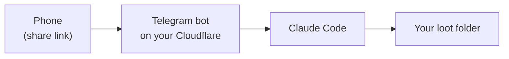

<h1> Petty Thief</h1>

Steal like an artist, from your phone. Forward a TikTok, Reel, Short, thread, repo or article to your own Telegram bot. When you open Claude Code, it tells you what's waiting and breaks each link down: the hook, the format, the tool, the workflow.

It steals ideas and techniques. Never content.

> Built for Claude Code. It's plain Markdown and shell inside, so other agents may work, but they're untested.



## Two ways to use it

| | Skill only | Skill + Telegram bot |
|---|---|---|
| You do | Paste a link into Claude Code | Forward links from your phone anytime |
| You need | Claude Code | Claude Code, Telegram, a free Cloudflare account |
| Setup | 1 minute | About 15 minutes, no terminal |
| Costs | Nothing | Nothing |

## Install the skill

In Claude Code, say:

> Install the petty-thief plugin from github.com/elviisaeva/petty-thief

Or run:

```bash
claude plugin marketplace add elviisaeva/petty-thief
claude plugin install petty-thief@petty-thief
```

Then paste any link and say "steal this". The first time, it asks you up to 5 questions about what you want from links.

## Add the Telegram bot

Follow **[docs/setup.md](docs/setup.md)**: seven steps with screenshots, no terminal.

[](https://deploy.workers.cloudflare.com/?url=https://github.com/elviisaeva/petty-thief/tree/main/worker)

## Lenses: understand a link

| Lens | For | Looks at | You also get |
|---|---|---|---|
| `creator` | content makers | hook, structure, editing, on-screen text, comments | **Steal this** (one reusable technique) and **your own hook** |
| `dev` | developers | is it real, how it works, how to reproduce, alternatives | **Adopt / Try / Skip** with one sentence why |
| `ai` | AI enthusiasts | the workflow, claims vs reality, cost, try it in 10 minutes | **Worth trying?** Yes / Later / No |
| `learn` | anyone | the core idea, a mental model, sources, one exercise | **One exercise**: a 15-minute task to make it stick |
| `design` | designers | palette, fonts, layout, spacing, UI patterns, each tagged with where it came from | **Steal this**: the one move to reuse, without copying |

### What every analysis contains

One Markdown file per link, in your language:

- **Seen / Not seen**: what Claude actually looked at (caption, page, repo, frames) and what it couldn't see. It never describes what it didn't see.
- **What it is** and **why it works**.
- **The lens's key finding**: the hook for `creator`, "does it exist?" for `dev`, and so on, plus a breakdown (by second or slide in deep mode).
- **Numbers**: only the ones that are visible, otherwise "not visible".
- **Your sections**: the ones you chose at setup, e.g. "For my content" and "For my workflow".
- **The lens's verdict** from the table above.
- **Not verified**: claims Claude couldn't confirm at the source.
- **Stash**: patterns worth remembering, also collected across all links in `_stash.md`.

Collections work differently: they give you a short card (facts plus the link, never the full text) and a line in your list.

## Collections: keep things

| Collection | View | What you get |
|---|---|---|
| `watchlist` | checklist | anime, series, films to watch; tick them off as watched |
| `recipes` | cards with photos | servings, time, ingredients and short steps; a photo grid you can search |
| `reading` | checklist | books and long reads; tick them off as read |

Each collection can get a private claude.ai page you open on your phone: checkboxes for checklists, a photo grid for recipes. Make your own collection ("set up a collection for board games") or lens ("make a lens for UX research"); Claude asks at most 4 questions.

Steer it with a note next to the link: `lens:dev`, `#recipes`, `lens:design,dev`, `deep`, or plain words like "how did they edit this".

## Where your loot goes

`~/Petty Thief/` (or any folder you choose):
- one file per link (design references in `design/`);
- one folder per collection, with `_list.md` and a card per item;
- `_index.md`, the list of everything handled;
- `_ideas.md`, ideas for your own work;
- `_stash.md`, patterns that keep showing up.

## Several projects, one bot

One bot can feed many projects. Tell Claude in a project "name this project brand for the bot", then add `*brand` to a link's note in Telegram: that link waits for the brand project only. Links without a tag go to whichever project opens the stash first. The bot confirms with `✓ stashed for *brand`.

## Make it yours

Everything personal lives in `~/.petty-thief/profile.yaml`. The skill is plain Markdown, so ask Claude to change it: "add a lens for UX research", "write my analyses in Spanish", "change the output template". See [docs/customize.md](docs/customize.md).

## Safe by default

- The bot stores link text only. It never touches TikTok, Instagram or anything else.
- Analysis uses public, no-login data by default. Logged-in looking runs only in **gentle mode**, with your yes for each item.
- Your keys stay yours: the bot token is an encrypted Cloudflare secret; the key that connects Claude Code is stored only on your computer (and appears once in your local Claude Code history, because you paste it; `/rotate` replaces it); the bot answers only you.

Read [docs/safety.md](docs/safety.md) before turning on deep mode. Questions about updating, uninstalling or Windows: [docs/faq.md](docs/faq.md).

## Works on Claude Pro

Petty Thief runs inside your normal Claude Code session, so it uses your plan's usage like any other request. Nothing runs in the background.

A quick look at one link takes about 5–6 steps, roughly 150–230k tokens including cached context (measured in [plugin/evals/usage.md](plugin/evals/usage.md)).

Graded eval suite: written, not yet run (the eval sandbox blocks the local fake server); unit and script tests run on every change.

Tips:
- quick mode is the default;
- the session reminder only speaks up when something new is waiting;
- by default Petty Thief handles 5 links per run and then asks before continuing; Max users can set `batch_size: 0` in the profile for no limit.

## Free, really

Cloudflare's free plan needs no card. If a limit were ever hit, the bot pauses until tomorrow and never charges you; personal use stays far below the limits. On a paid Cloudflare plan, usage is negligible and capped by the bot. Analysis runs in your own Claude Code session, so there's no extra API bill.

## License

MIT. Security issues: see [SECURITY.md](SECURITY.md).

Mascot: ChatGPT image generation, directed by Elvira Isaieva.
