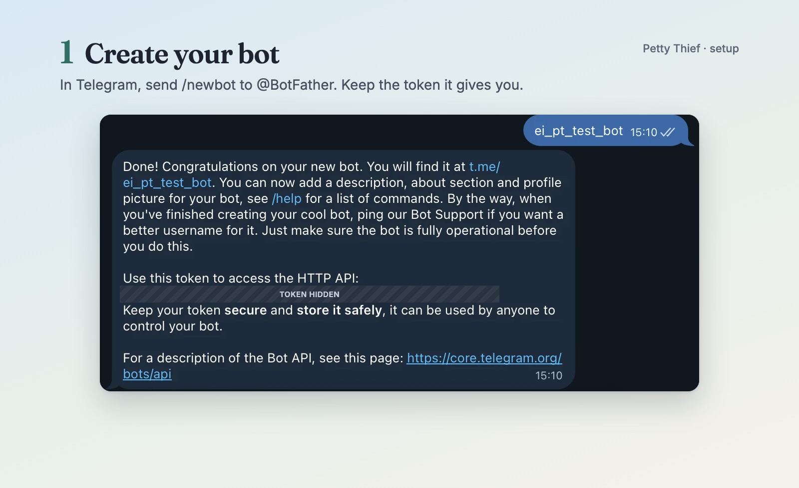
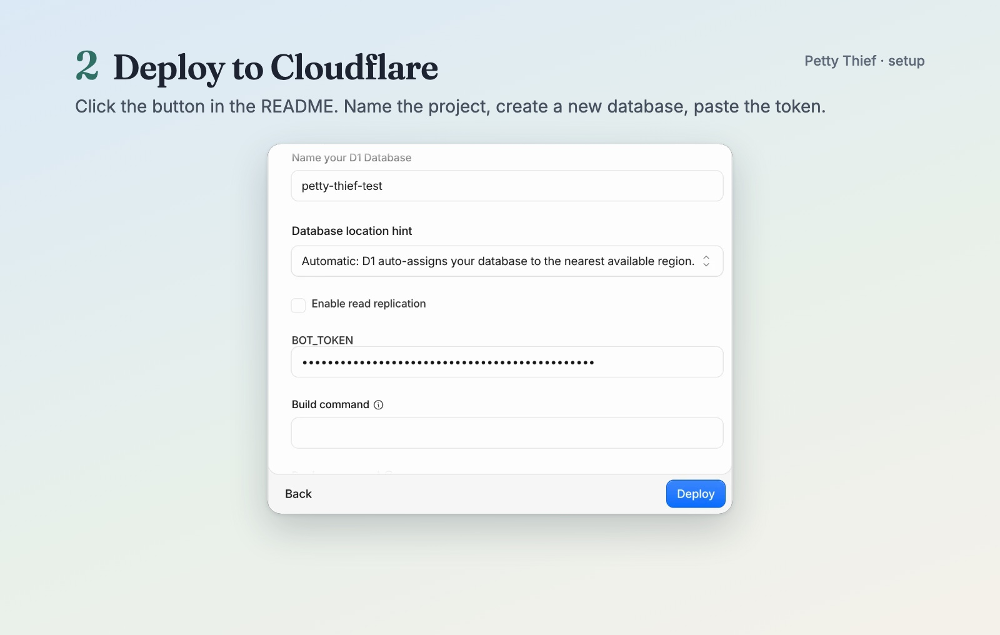
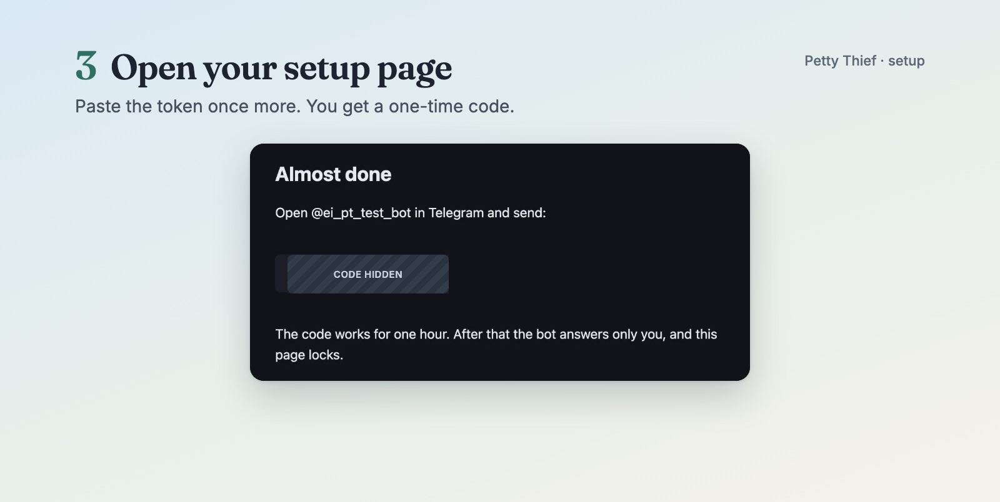
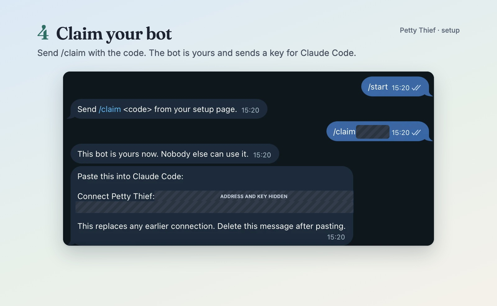
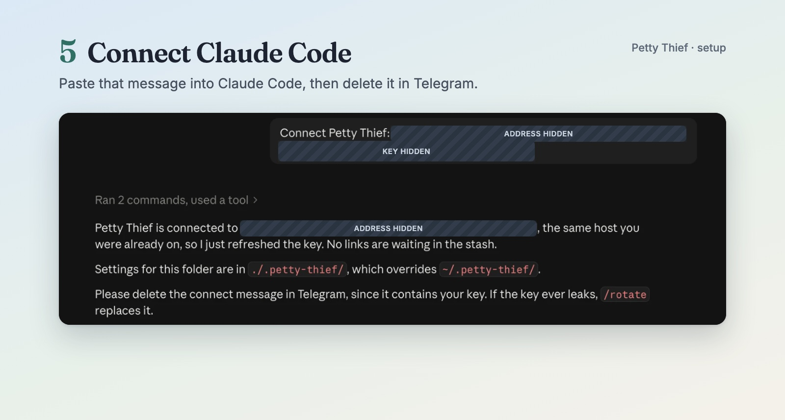
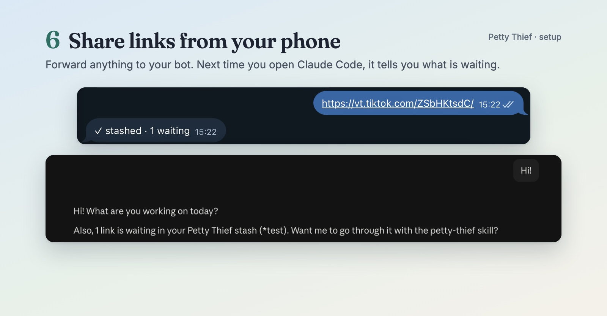
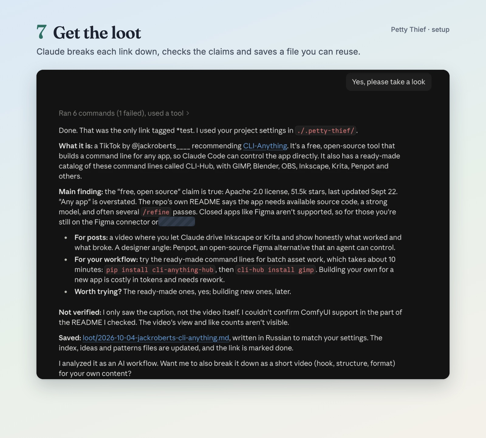

# Set up the Telegram bot

About 15 minutes. No terminal, nothing to install. You need Telegram, an email address, and a **GitHub account** (free; [sign up here](https://github.com/signup) if you don't have one). The Deploy button copies Petty Thief into your own GitHub account, so Cloudflare can build it from there. A GitLab account works too.

## 1. Create your bot

1. In Telegram, open **@BotFather** and send `/newbot`.
2. Pick a name (anything, like "My Petty Thief") and a username ending in `bot`.
3. BotFather replies with a **token** that looks like `123456789:AA…`. Keep this chat open: you need the token twice.
4. Optional: send `/setuserpic` to @BotFather to give your bot a face (a square image).

You don't need to set a description or a command list in BotFather: they are set automatically during setup (and refreshed whenever you send `/connect`).



## 2. Deploy to Cloudflare

1. Click **Deploy to Cloudflare** in the README.
2. Sign up or log in to Cloudflare. The free plan is enough, and no card is needed.
3. Connect your GitHub (or GitLab) account when asked. Cloudflare creates a copy of the repo there.
4. Tick **Create private Git repository** if you don't want your copy to be public.
5. Already running Petty Thief on this Cloudflare account? Change **Project name** (for example `petty-thief-2`) and pick **+ Create new** under the D1 database. Never select a database you already use: the new bot would share it.
6. When it asks for `BOT_TOKEN`, paste the token from step 1.
7. Click **Deploy** and wait about a minute.
   If this is your first worker, Cloudflare also registers a free `workers.dev` subdomain for your account; you may be asked to pick its name. It becomes the `<you>` part of the address below.
8. Copy your bot's address. It looks like `https://petty-thief.<you>.workers.dev`.



## 3. Open your setup page

1. Open `https://petty-thief.<you>.workers.dev/setup`.
2. Paste the bot token again. This proves the bot is yours; it isn't stored a second time.
3. You'll see a one-time code.



## 4. Claim your bot

1. Open your bot in Telegram.
2. Send `/claim` and the code, for example `/claim K7Q2PX`.
3. The bot answers "This bot is yours now" and sends a **connection message**.

Pressing **Start** before you claim only gets the answer "Send /claim <code> from your setup page." That's expected.



## 5. Connect Claude Code

1. Copy the whole connection message.
2. Paste it into Claude Code as a normal message. Petty Thief reads it and connects; you never type a command or copy the key anywhere else.
3. Delete the message in Telegram.



## 6. Share links from your phone

Share a TikTok, a Reel, a repo or an article to your bot. It answers `✓ stashed · 1 waiting`. Next time you open Claude Code, it tells you a link is waiting.



## 7. Get the loot

Say "yes" (or "go through my stash"). Claude breaks each link down, checks the claims at the source, and saves a file you can reuse, plus your list of everything analyzed.



## If something goes wrong

| You see | Do |
|---|---|
| "Cloudflare has no BOT_TOKEN secret yet" | Open your worker in Cloudflare → Settings → Variables and Secrets, add a secret named `BOT_TOKEN` with your bot token, then reload the setup page. |
| "That token doesn't match" on the setup page | Copy the token again from @BotFather, with no spaces. |
| "Telegram said no" with "Couldn't reach Telegram" | Telegram didn't answer in time. Wait a minute and submit the setup page again. |
| "Telegram said no" (other reasons) | The token was revoked or mistyped. Get a fresh one with `/token` in @BotFather and update `BOT_TOKEN` in Cloudflare → your worker → Settings → Variables and Secrets. |
| "This code has expired" | Open `/setup` again for a new code. |
| "Wrong code." or "Too many wrong codes…" | Open `/setup` again for a new code. |
| The "Setup is finished" page | This bot is already claimed. To reconnect Claude Code, send `/connect` to the bot. |
| "That form didn't come through" | Reload the setup page, paste the token again and submit. |
| The "Slow down" page | Wait a minute and try again. |
| The bot doesn't answer | Make sure you claimed it from your own account. Strangers get no answer on purpose. |
| Claude Code says "not connected" | Send `/connect` to the bot and paste the new message into Claude Code. |
| You think your key leaked | Send `/rotate` to the bot. The old key stops working immediately. |

## For developers

```bash
cd worker && npm install
npx wrangler d1 create petty-thief
```

Then copy `wrangler.jsonc` to `wrangler.local.jsonc` (it is gitignored) and add the printed `database_id`, and run:

```bash
npx wrangler secret put BOT_TOKEN --config wrangler.local.jsonc
npm run deploy:dev
```

`npm run deploy:dev` applies the migrations to your remote database and then deploys (there is only `0001_init.sql`, and applying it again is a no-op; columns added later, such as `tag`, are added by the worker itself on its first request), both with `--config wrangler.local.jsonc`. Don't use `npm run deploy` here: it is the Deploy button's command, reads the tracked `wrangler.jsonc` and skips migrations, because the worker creates any missing tables itself on its first request.

Then continue from step 3.
